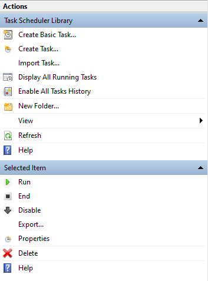
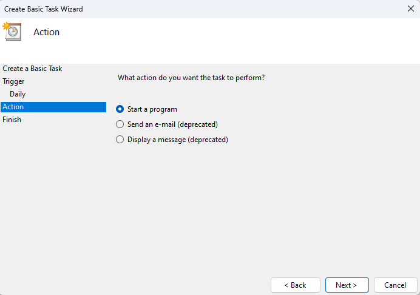

# News Aggregator Backend
This project is mainly about fetching news articles from various sources and stores them in a database (currently using MongoDB). Users also have the choice to export the data from database to a json file.

## Getting started

These instructions will get you a copy of the project up and running on your local machine for development and testing purposes.

### Prerequisites
- Java 21 or higher
- Maven 3.9.6
- MongoDB 5.0.3
- Docker

### Installation
1. Clone the repository
```bash
git clone https://github.com/OOPProject20232/NewsAggregator_Backend.git
```
2. Navigate to the project directory
```bash
cd NewsAggregator_Backend
```
3. Make .env file for the project, containing:
- MONGODB_PUBLIC_API_KEY
- MONGODB_PRIVATE_API_KEY
- MONGODB_DATABASE_NAME
- MONGODB_CLUSTER_NAME
- MONGODB_CONNECTION_STRING
(It will work with your own MongoDB database so you dont have to worry)
4. Run the project
   1. Manually
   <br>
   You can do this by running the Main.java class:
   ```java
   public class Main {
    public static void main(String[] args) {
        Crawler rss = new RSSReader();
        rss.crawl();
        IPostDataAccess db = new MongoDB();
        db.importToDatabase(rss.getPostList());
        db.createSearchIndex();
        db.exportDataToJson("src/main/resources/data.json");
        }
    }
    ```
   2. Using Docker + Crontab/ Task scheduler
   <br>
   You need to write a Dockerfile in the project root
   <br>
   
   <br>
   The example Dockerfile should be like this:
       ```Dockerfile
       FROM maven:3.9.6-eclipse-temurin-21 AS builder
       WORKDIR /app
       COPY pom.xml .
       COPY src ./src
       RUN mvn package -DskipTests

       FROM eclipse-temurin:21
       WORKDIR /app
       COPY --from=builder /app/target/newsaggregator_backend-jar-with-dependencies.jar .
       COPY --from=builder /app/target/classes/rssdata/ ./src/main/resources/rssdata/
       COPY --from=builder /app/target/classes/data.json ./src/main/resources/data.json
       COPY --from=builder /app/target/classes/log4j.properties ./src/main/resources/log4j.properties
       EXPOSE 8080
       CMD ["java", "-jar", "newsaggregator_backend-jar-with-dependencies.jar"]
       ```
       
      Then you can build a docker image using the following command:
      
       ```bash
       docker build -t newsaggregator_backend .
       ```
      
      This will create a docker image named newsaggregator_backend.
       <br>
       Now you can run the docker image using the following command:
      
       ```bash
       docker run -d newsaggregator_backend
       ```
       
      or
      
       ```bash
        docker run -d -p 5000:8000 newsaggregator_backend
        ```
       
      This will run docker image on port 5000 for your host machine and port 8000 for the container.
      <br>And there you go, the project is running on your machine.
      <br><br><b>But wait, there is more!</b>
       As you want to constantly fetch the news articles, you can use crontab on linux or Task scheduler on windows.
       <br>I am using Windows so i will be showing you how to do it
       <br>
       - Open Task Scheduler and click on `Create Basic Task`
       <br>
       
       <br> Just give it a name and description to your liking.
       - Follow the wizard with the default settings until you reach `Action` tab
       
       <br> Select `Start a program` and click next 
       - In the `Program/script` field, write the path to a batch file executable
       The batch file should contain the following command:
       ```bash
       docker run -d newsaggregator_backend
       ```
