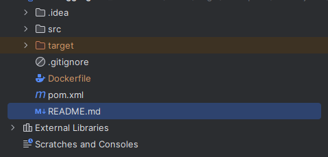

# News Aggregator Backend
This project is mainly about fetching news articles from various sources and stores them in a database (currently using MongoDB). Users also have the choice to export the data from database to a json file.

## Getting started

These instructions will get you a copy of the project up and running on your local machine for development and testing purposes.

### Prerequisites
- JDK 21 or higher
- Maven 3.9.6
- MongoDB 5.0.3
- Docker

### Installation
1. Clone the repository

```bash
git clone https://github.com/OOPProject20232/NewsAggregator_Backend.git
```

2. Navigate to the project directory

```bash
cd NewsAggregator_Backend
```

3. Make `.env` file for the project:
>[!IMPORTANT]
> Please create a MongoDB Cluster and Database to get the following fields, must fill in all the information or else it won't work!!!
> For more information, please take a look at <a href="https://youtu.be/Z05rVI5mhzE?si=azRuVJsPT0V4MgyY&t=334">Florian Ludewig's video</a>.
- `MONGODB_PUBLIC_API_KEY`
- `MONGODB_PRIVATE_API_KEY`
- `MONGODB_DATABASE_NAME`
- `MONGODB_CLUSTER_NAME`
- `MONGODB_CONNECTION_STRING`
- `MONGODB_SEARCH_INDEX_NAME`
- `MONGODB_GROUP_ID`
- `RAPID_API_KEY`

>[!NOTE]
> Regarding the RAPID_API_KEY, please create an account on <a href="https://rapidapi.com/hub">RapidAPI</a>.
> Use <a href="https://rapidapi.com/Coinranking/api/coinranking1/">CoinRankingAPI</a> and copy your `X-RapidAPI-Key`

> [!NOTE]
> Why making it hard? because the project is being pushed to Github and public Google Drive so we had to hide our API keys.
> <br> If you are a teacher from HUST and having trouble running the app, please feel free to contact us through our emails given in the project report 
4. Run the project
   1. Manually
  
   You can do this by running the Main.java class in package newsaggragator

   Then, once the terminal having "Starting server...", go to your browser and type

   ```text
   - localhost:8000/v1/articles // to crawl articles
   - localhost:8000/v1/posts // to crawl posts (we only support reddit.. for now)
   - localhost:8000/v1/coins // to update coins' prices
   ```
    Declare more endpoints if you were to scale the app

    2. Using Docker + cloud service
  
   You need to write a Dockerfile in the project root

   

   The example Dockerfile should be like this:
  
   ```Dockerfile
   FROM maven:3.9.6-eclipse-temurin-21 AS builder
   WORKDIR /app
   COPY pom.xml .
   COPY src ./src
   RUN mvn clean package -DskipTests

   FROM eclipse-temurin:21
   WORKDIR /app
   COPY --from=builder /app/target/newsaggregator_backend-jar-with-dependencies.jar .
   COPY --from=builder /app/target/classes/ ./src/main/resources/
   RUN rm -rf ./src/main/resources/newsaggregator
   EXPOSE 8000
   CMD ["java", "-jar", "newsaggregator_backend-jar-with-dependencies.jar"]
   ```
   Login to Github > Settings > Developer Settings > Personal Access Token (PAT) > Create a new one with create and delete packages privilege > Save your PAT so you can use it later

   Then type the following command in your ide terminal:
    ```bash
    docker login --username <your-username> --password <PAT> ghcr.io
    ```
   This will login you to Github container registry.

   Now you can build the docker image using the following command:

   ```bash
   docker build . -t ghcr.io/<your-username>/<your-app-name>:latest
   ```
   Wait for it to build a docker image, then you can choose to run it or push it to Github

   ```bash
   docker push ghcr.io/<your-username>/<your-app-name>:latest
   ```
   Our team deploy the docker image on Koyeb because it is free.

   After deployment, it will give you a link to your app which you can request to crawl.

   E.g: <domain>/v1/articles will trigger the server to crawl for articles

   But you still have to call it manually right?

   How about using <a href="https://cron-job.org/en/">cron-jobs.org</a>? Just create a new job and put your previously created endpoints from Koyeb and set it's interval

   Our team had set it to crawl for articles every hour, coins everyday at 8AM

   There's a downside that we could not crawl for posts automatically regarding reddit's authentication which is complicated and time consuming
